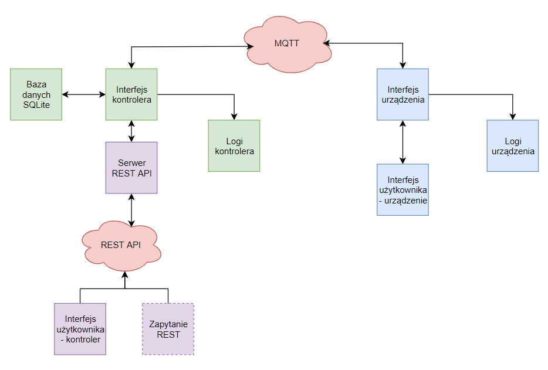

# Kontroler punktow swietlnych

Projekt pozwala na kontrolowanie symulowanych punktow swietlnych za pomoca protokolu MQTT.
Na projekt sklada sie 5 czesci: 
- aplikacja symulujaca punkt swietlny 
- interfejs uzytkownika dla punktu swietlnego 
- aplikacja kontrolera
- interfejs uzytkownika dla kontrolera
- baza danych SQLite dla punktow swietlnych

## Schemat dzialania


## Instalacja
Podstawowym wymaganiem jest instalacja brokera MQTT, w projekcie uzywany byl **"mosquitto"** w wersji **1.6.8** 
zainstalowany na Arch Linux - dystrybucja Manjaro, z wykorzystaniem polecenia:
```bash
sudo pacman -Sy mosquitto
```
Nastepnie nalezy za pomoca pliku requirements.txt, zainstalowac odpowiednia wersje modulu **"paho-mqtt"** 
odpowiadajacego w Pythonie za obsluge protokolu MQTT. Wykorzystywana wersja Pythona - **3.8**
```bash
pip3 install -r requirements.txt
```
## Uruchomienie
Ponizej opisany jest sposob na podstawowe uruchomienie oraz typowe dzialania. Dokladny opis 
aplikacji znajduje sie w dalszej czesci.
Kolejnosc uruchamiania nie ma znaczenia. Nalezy pamietac aby **lightbulb_interface.py**, uruchamiac bedac w ich
folderze, lub z wykorzystaniem IDE jako projekt. Ograniczenia subskrybowania mqtt, sprawiaja ze kontroler bedzie w
stanie dodac i odczytac ID tylko ostatnio uruchomionego punktu swietlnego. Aby polaczyc pozostale wystarczy wprowadzic
w interfejsie konkretnego urzadzenia **'4'**, badz zrestartowac dany interfejs.

Do zapewnienia dzialania nalezy uruchomic **"main.py"** z glownego folderu projektu, oraz **"lightbulb_interface.py"** z 
folderu **"lightbulbus"**
- **"main.py"** - wymaga podania za pomoca argumentu **"-n"** unikatowej nazwy kontrolera, pozostale dostepne, 
opcjonalne argumenty mozna wyswietlic podajac argument **"-h"**
- **"lightbulb_interface.py"**  wymaga podania argumentu **"-id"**: unikatowego ID punktu swietlnego po ktorym bedzie on 
rozpoznawany. Jak wyzej, pozostale, opcjonalne argumenty widoczne sa za pomoca **"-h"**. Domyslnie wszystkie punkty 
uruchamiane sa w stanie wylaczonym.

## Dzialanie
Wszystkie dzialania wykonuje sie za pomoca polecen interfejsow.

**Kontroler:**

Z konsolowego menu mozemy kolejno:
- Wyswielic liste aktywnych urzadzen wraz z ich stanem, gdzie **"OFF"**,**"ON"** oraz **"?"**, oznaczaja odpowiednio: 
wylaczony, wlaczony, oraz nieznany stan. Korzystajac z odpowiedniej opcji kolejnego menu
mozemy wybrac opcje wyswietlania, takie jak: wyswietl wszystkie rekordy, wyswietl tylko wlaczone/wylaczone, o
raz wpisz ID punktu ktory chcesz wyswietlic. Wszystkie rekordy pobierane sa z bazy danych SQLite.


- Wlaczyc/Wylaczyc urzadzenia. Kazda z tych opcji ma rowniez podmenu pozwalajace wybrac pomiedzy wlaczeniem/wylaczeniem
wszystkich urzadzen, a wpisaniem ID urzadzenia do wylaczenia


- Wyswielic stan polaczenia z kontrolerem w celu diagnostyki.


- Zakonczyc dzialanie programu. **UWAGA** konczac dzialanie program usuwa tabele SQLite ze stanami urzadzen, w celu 
zapobiegniecia falszywych wartosci przy ponownym uruchomieniu. W wypadku ponownego uruchomienia, 
kontroler natychmiast otrzymuje ID oraz status, dzieki wykorzystaniu funkcji **"retain"** protokolu MQTT,


**Mockup punktu swietlnego:**
- Wyswietlic swoj obecny status zawierajacy: ID, stan polaczenia, oraz status swiecenia.
- Zmienic status oswietlenia na wlaczony/wylaczony 
- Odnowic polaczenie w wypadku jego utraty
- Zakonczyc dzialanie programu i poinformowac o tym kontroler

Ponadto, domyslnie obie aplikacje prowadza rejestr komunikatow wymienianch za pomoca protokolu MQTT, zawierajacy 
polecenia wraz z data i godzina zarejestrowania.

## Przykladowe dzialanie - odczytanie stanu a nastepnie wlaczenie wszystkich urzadzen

w folderze glownym projektu:
```bash
python main.py -n kontroler
```

w osobnych konsolach, wewnatrz katalogu /lightbulbs:
```bash
$1 - python lightbulb_interface.py -id alfa
$2 - python lightbulb_interface.py -id beta
$3 - python lightbulb_interface.py -id gamma
$4 - python lightbulb_interface.py -id zeta
```

Przy poprawnym uruchomieniu, zobaczymy interfejs kontrolera wraz z czterema interfejsami punktow swietlnych.
Interfejs kontrolera juz powinien pokazywac informacje na temat dodania najmlodszego urzadzenia oraz zmiany jego
statusu na domyslny "OFF". 
Najpierw wyswietlimy wszystkie aktywne urzadzenia wpisujac w interfejsu najpierw **1**, nastepnie zas **1**. 

Poinien ukazac nam sie taki wynik:
**[('zeta', 'OFF'), ('gamma', 'OFF'), ('beta', 'OFF'), ('alfa', 'OFF')]**


Jesli jakis wynik nie wyswietla sie (prawdopodobne jesli najpierw uruchomimy wszystkie urzadzenia), wystarczy
w interfejsie danego urzadzenia wprowadzic **4** 
Teraz aby ustawic wszystkie urzadzenia na stan 'ON' naraz, wystarczy wprowadzic w interfejsie kontrolera 
najpierw **2**, nastepnie zas **1**.


Po powtorzeniu komend wyswietlajacych wszystkie urzadzenia powinnismy zobaczyc:
**[('zeta', 'ON'), ('gamma', 'ON'), ('beta', 'ON'), ('alfa', 'ON')]**
## Dokladny opis plikow i klas
**main.py**:

Plik ten zawiera funkcje odpowiadajace za komunikacje pomiedzy uzytkownikiem a aplikacja kontrolera, w tym pliku rowniez
znajduje sie parser argumentow, oraz inicjalizacja obiektu klasy **"ControllerMQTT"**. W funkcji main, po nawiazaniu 
polaczenia, wykonywana jest komenda 
```python
time.sleep(0.5)
```
majaca na celu wstrzymanie pracy programu, do momentu az otrzyma on i zapisze wszystkie wiadomosci 
przychodzace na zasubskrybowane tematy.

**controller_mqtt_client**:

Jest to serce dzialania calej aplikacji. W tym pliku opisane sa metody kontrolera. Podczas inicjalizacji, kontroler,
dziedziczacy z klasy paho.mqtt.client.Client, tworzy obiet bazy danych: **"ControllerSqlite"**, nawiazuje z nia polaczenie oraz
tworzy pusta tabele stanow urzadzen(o ile dana tabela nie istniala wczesniej). Okresla rowniez czy zapisywane beda logi
wykonywanych polaczen za pomoca protokolu (domyslnie tak). 
Najwazniejsza metoda tej klasy jest nadpisana metoda klasy bazowej:
**"on_message"**, wywolywana w momencie otrzymania wiadomosci. Metoda ta okresla w jaki sposob poznawane sa, najpierw
ID, nastepnei zas stany wszystkich aktywnych urzadzen.
- Pierwszym etapem, jest otrzymanie wiadomosci na domyslnie subskrybowany temat **"active"**, mockupy urzadzen, wysylaja
na nie swoje ID w momencie uruchomienia ich interfejsu. Gdy kontroler otrzyma juz ID, zapisuje je w bazie danych z
statusem **"?"** oraz subskrybuje prywatny temat danego urzadzenia: **"status-{ID_urzadzenia}"**.
- Drugim etapem jest odczytanie statusu, ktore urzadzenie wysyla na powyzszy temat, a nastpenie zaktualizowanie bazy 
danych. Kontroler otrzymuje status urzadzenia w momencie zasubskrybowania tematu, gdyz mockupy, publikuja z parameterm
**"retain"** sprawiajacym iz najnowsza publikacja zostaje zapisana i wyslana do subskrybentow niezaleznie od momentu w 
ktorym zasubskrybuja
- Ostatnia czescia metody jest otrzymanie wiadomosci na temat **"nonactive"** oznaczajcy zakonczenie dzialania 
interfejsu punktu swietlnego. Po otrzymaniu wiadomosci, urzadzenie o danym ID zostaje usuniete z bazy danych, zostaje
rowniez wypisana odpowiednia wiadomosc wraz z ostatnim znanym statusem urzadzenia.

**controller_sqlite_client.py**:


Plik zawiera klase **"ControllerSqlite"** ktorej metody skupiaja sie wylacznie na zarzadzaniu baza danych punktow
swietlnych. Pozwalaja one na dodawanie, modyfikowanie oraz usuwanie wpisow. Poadto znajduja sie tu metody pozwalajace
na stworzenie i usuniecie tabli zawierajacej. Usuwanie tabeli jest szybsze i zajmuje mniej kodu niz tworzenie petli 
usuwajacej wszystkie rekordy na zakonczenie dzialania programu. Zapelnionej tabli nie mozna zostawic, gdyz po 
ponownym uruchomieniu, ciezko byloby stwierdzic ktore urzadzenia sa obecnie aktywne, a ktore pozostaly w bazie po
wczesniejszym uruchomieniu.


**lightbulb_interface.py**:

Podobnie jak **"main.py"** plik ten zawiera interfejs uzytkownika, tyle ze tym razem dla symulowanych punktow swietlnych
oraz parser argumentow. W funkcji main znajduja sie komendy odpowiadajace za nawiazanie polaczenia, uruchomienie 
petli MQTT oraz wyswietlanie menu. Zawartosc wyswietlanego menu zdefiniowana jest w osobnych funkcjach, jest rowniez
znacznie mniej obszerna niz menu kontrolera.


**lightbulb.py**

W pliku tym opisana jest klasa **"LightBulb"** bedaca posrednikiem w komunikacji pomiedzy urzadzeniem/uzytkownikiem, 
a kontrolerem. Klasa ta, tak jak klasa kontrolera, dziedziczy z paho.mqtt.client.Client. Rowniez ta klasa, tworzy logi
komunikacji poprzez MQTT.Kazdy klient punktu swietlnego subskrybuje dwa tematy, **"command-{ID}"** oraz 
**"command-all"**, pozwalajace na odczytwanie zadan zmiany stanu przesylanych od kontrolera. Klasa ta nie ma polczenia
z baza danych. Wszystkie stany urzadzen wysyalne sa z parametrem **"retain"** tak aby ewentualna przerwa w polaczeniu z 
kontrolerem nie przeszkodzila w przekazaniu wiadomosci.
Zarowno lightbulb.py jak i controller_mqtt_client.py, pokazuja warningi o niezgodnosci sygnatury nadpisujacej metody z 
metoda bazowa. Wynika to prawodpodobnie z uzcia dekoratorow w klasie bazowej. W celu upewnienia sie czy ten metody sa 
napisane poprawnie porownano je z przykladowymi skryptami napisanymi przez jednego z devolperow oprogramowania mosquitto.
[Repozytorium przykladow](https://github.com/eclipse/paho.mqtt.python/tree/master/examples), bedacym jednym z 
repozytoriow Eclipse.


## Licencja
[MIT](https://choosealicense.com/licenses/mit/)